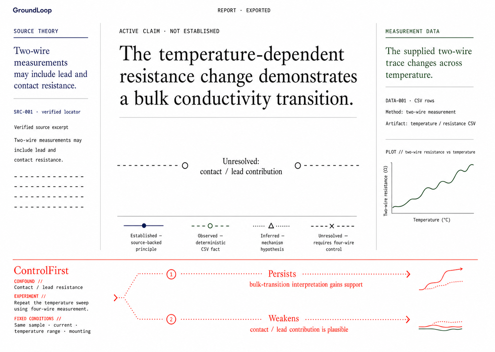
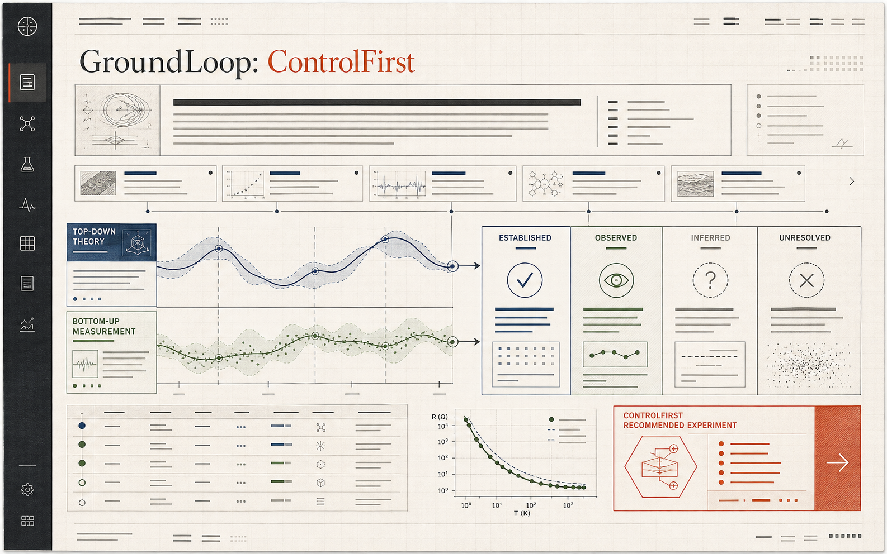
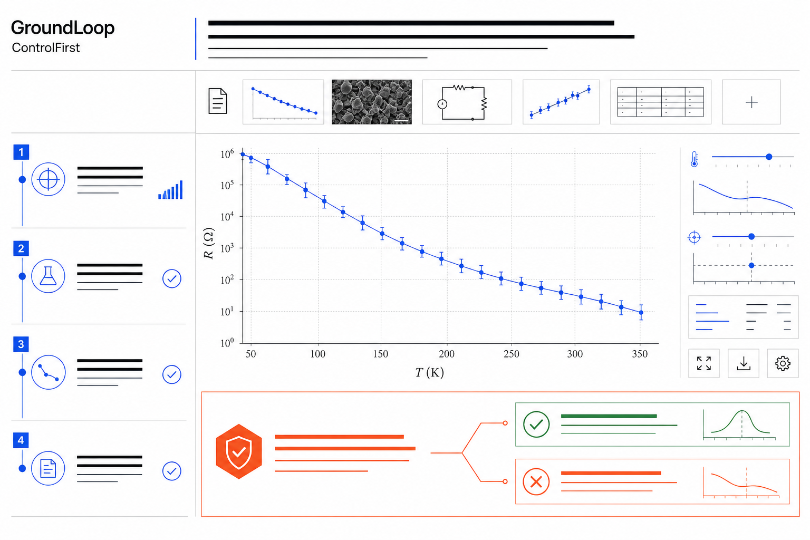
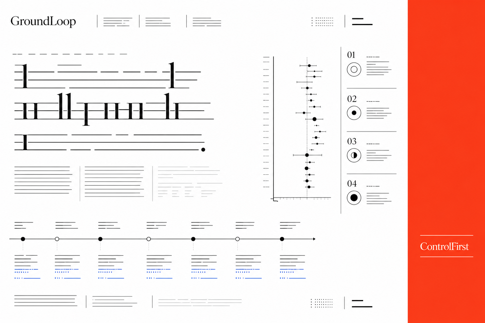
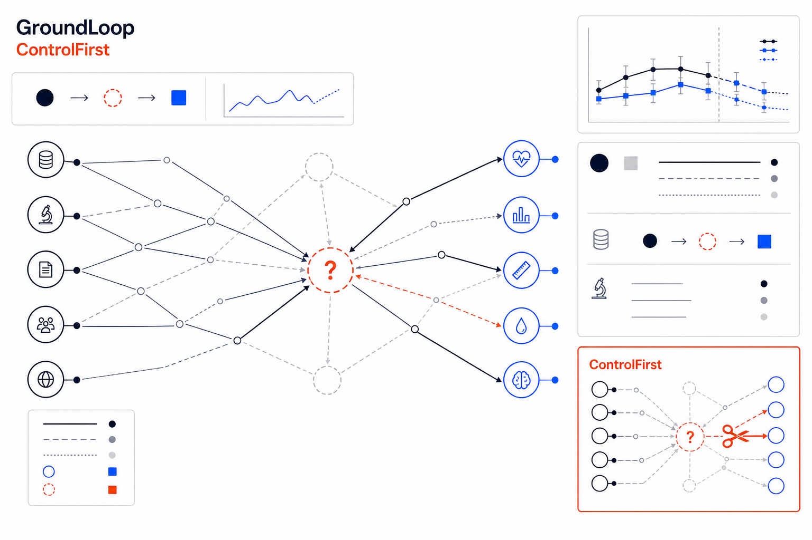

# GroundLoop UI direction

## Selected implementation target



This is the visual baseline for the MVP report screen. It uses the fixed `four_wire_contact_control` scenario, marks the research claim as not established, separates source-backed theory from deterministic measurement, makes the unresolved contact/lead contribution explicit, and ends with one discriminating four-wire control.



The first image above is an early generated visual direction board, not a literal UI specification. It established the desired information hierarchy, but its paper texture is superseded by the white-background directions below.

## White-background directions

### 1. Clinical instrument — recommended base



Strong for the primary report screen: it makes deterministic measurement and provenance feel trustworthy, and it can be implemented cleanly with normal UI primitives. Keep its white canvas, cobalt data, and restrained coral decision panel. Do not retain its many small thumbnail modules.

### 2. Swiss editorial



Strong for brand, onboarding, and the claim header. It is too sparse for the working report screen, so use its typography, whitespace, and tall ControlFirst edge treatment—not its literal layout.

### 3. Evidence map



This is the most distinctive product moment: a visible map of source evidence, measurements, inference, and the unresolved mechanism. Use it only on the Evidence Packet screen or as a focused report module. Making every screen a graph would obscure the actual research workflow.

## Chosen synthesis

Use the final **Alignment** target as the visual baseline, with one intentional information-architecture update: the report opens on a compact **Decision brief** (verdict, why it is blocked, next control, and two discriminating outcomes). Before that brief, a high-contrast **decision sequence** makes the whole research story legible in seconds: what changed, what cannot yet be claimed, and the one measurement that decides it. Measurement and the concise three-state explanation follow; provenance is an explicitly opened Audit Trail. The earlier clinical, editorial, and evidence-map directions remain exploration references only.

## Design position

GroundLoop should feel like a scientific working paper, not an AI chat surface or an enterprise dashboard. The interface makes a researcher slow down at the exact point where an observation risks becoming an overconfident mechanism claim.

### Visual rules

- **Base:** pure white `#FFFFFF`, graphite `#20211E`, ink `#17324D`.
- **Evidence:** source-backed `#17324D`, observed measurement `#355B3C`, inferred `#7A6955`, unresolved `#6A4A4A`.
- **Decision:** copper `#C8502A` is reserved for ControlFirst and destructive attention only.
- **Typography:** editorial serif headings; compact monospaced metadata and locators; neutral sans-serif for controls.
- **Geometry:** hairline rules remain the default. Use large rounded surfaces only for the start-screen invitation and the three-step decision sequence; they signal a meaningful action or decision, never a generic card. No glass cards, no decorative gradients, and no oversized dashboard metrics.
- **Atmosphere:** use a quiet mineral wash (`#F3F7F4`) and shallow ink shadow only behind those primary surfaces. It adds contemporary depth without turning GroundLoop into a chat product or weakening the report's paper-like audit trail.
- **Accessibility:** each evidence state has a label, icon, and pattern in addition to color. Contrast remains legible on the paper background.

## Navigation and screens

The product has four deliberate screens, matching the current implementation contract:

1. **Entry** — claim, methods, and bounded CSV. The generic path is first; the R(T) fixture remains an explicit method-aware demo.
2. **Convergence Map** — artifact profiles, confirmed bindings, required signatures, alignment states, dominant gap, and control-pending or committed control rail.
3. **Source Review** — imported literature candidates, provider/status/query/locator provenance, semantic review state, and evidence role.
4. **Audit / Export** — one deliberate copy action sends the Run brief to Codex; no hidden model call comes from the browser. The UI then watches the saved run and renders the exported report.

The static [report prototype](controlfirst-report-prototype.html) is an early structural experiment. The selected Alignment image above is the current visual target; persisted report JSON remains the source of truth for all visible content.

### Scope and relevance at setup

The setup screen states the active boundary before a Run starts: generic tabular CSV by default, or the explicit R(T) contact-control fixture when selected. It never silently treats a broad scientific question as supported. Header and unit inference are advisory; Codex must still read the method and literature before committing signatures or controls.

Imported literature candidates show provider, publication status, locator, query or discovery rationale, and excerpt hash. They are untrusted candidates until Codex classifies every supplied excerpt and locator as direct, contextual, or reject. Once saved, the semantic rationale—not lexical overlap or title match—is shown in the frozen packet and report.

After source review and data binding, the researcher explicitly freezes the selected sources, method, artifact hashes, and bindings. The UI records this event and every later MCP save in a visible decision history. A frozen packet can produce only Observed, Confounded, Missing, or Contradicted alignments and one atomic ControlFirst experiment. Follow-up controls are presented as later work, never bundled into the first discriminating experiment.

## Layout contract for the report

```text
Header: run identity, state, exported timestamp
Decision sequence: observed data fact → dominant confound or missing observable → decisive next control
Decision brief: verdict, blocking reason, ControlFirst experiment, two outcomes
Measurement boundary: artifact profile, confirmed bindings, deterministic evidence IDs
Claim boundary: signatures with Observed, Confounded, Missing, or Contradicted alignment states
Audit Trail: source provenance, excerpt hashes, artifact hashes, and decision history
```

On narrow screens, the traces and state matrix stack vertically; the ControlFirst panel remains visually last and full width. No state is hidden behind hover-only UI.
